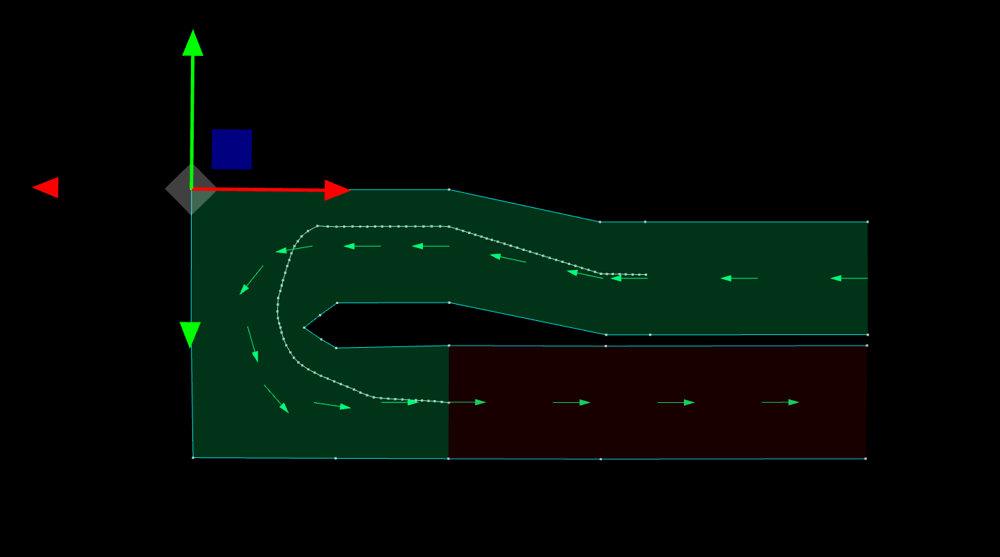
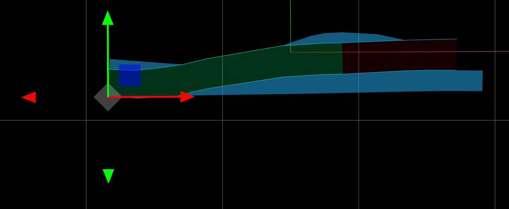

# autoware_lanelet2_utils

## Nomenclature

This package aims to strictly define the meaning of several words to clarify the documentation and API's scope. In the table below, `codespace` words are given specific meanings when used in the API and API description. _italic_ words are emphasized to indicate that it refers to social common sense which often comes with ambiguity. To help disambiguate the meaning, illustration is provided. "Lanelet" refers to the entity of a`lanelet::ConstLanelet` object in order to distinguish with the word "lane" used in social customs. `A` and `B` stands for some Lanelets objects.

| Word                              | Meaning                                                                                                                             | Illustration                                                                                                                                                                                                                                                                                                                                                  |
| --------------------------------- | ----------------------------------------------------------------------------------------------------------------------------------- | ------------------------------------------------------------------------------------------------------------------------------------------------------------------------------------------------------------------------------------------------------------------------------------------------------------------------------------------------------------- |
| `driving`                         | The vehicle position belongs to the designated Lanelet.                                                                             | In each map, green Lanelet are the `driving` lanes of the vehicle.<br><br>[Open]({{ drawio("/common/autoware_lanelet2_utils/media/nomenclature/driving.drawio.svg") }})                                                                                                                                    |
| `boundary`,<br>`entry`,<br>`exit` | The `boundary` of a Lanelet refers to the left or right Linestring.                                                                 | <br>[Open]({{ drawio("/common/autoware_lanelet2_utils/media/nomenclature/boundary_entry_exit.drawio.svg") }})                                                                                                                                                                      |
| `adjacent`                        | If A is `adjacent` to B, A and B share a common `boundary` with same direction either on the left or right side.                    | In each map, orange Lanelet is `adjacent` to green Lanelet.<br><br>[Open]({{ drawio("/common/autoware_lanelet2_utils/media/nomenclature/adjacent.drawio.svg") }})                                                                                                                                        |
| `same_direction`                  | Lanelet A and Lanelet B are `same_direction` if A and B are directly or indirectly `adjacent` to each other.                        | In each map, orange Lanelets are `same_direction` as green Lanelet.<br><br>[Open]({{ drawio("/common/autoware_lanelet2_utils/media/nomenclature/same_direction.drawio.svg") }})                                                                                                              |
| `bundle`                          | A `bundle` refers to a transitive closure set of Lanelets which are `same_direction` to each other.                                 | The enclosed sets of Lanelets are `bundle`s.<br><br>[Open]({{ drawio("/common/autoware_lanelet2_utils/media/nomenclature/bundle.drawio.svg") }})                                                                                                                                                             |
| `opposite`                        | If A is `opposite` to B, A and B share a common `boundary` with opposite direction.                                                 | In the first map, green Lanelet and orange Lanelet are `opposite` to each other.<br>In the second map, two red Lanelets are not `opposite` relation because they do not share a common LineString.<br><br>[Open]({{ drawio("/common/autoware_lanelet2_utils/media/nomenclature/opposite.drawio.svg") }}) |
| `opposite_direction`              | If A and B are `opposite_direction`, the `bundle` of A and B are directly `opposite` to each other.                                 | In the each map, green Lanelet and orange Lanelet are `opposite_direction` because their `bundle`s(enclosed in dotted line) are `opposite` relation.<br><br>[Open]({{ drawio("/common/autoware_lanelet2_utils/media/nomenclature/opposite_direction.drawio.svg")  }})                |
| `connected`                       | A is `connected` to(from) B if and only if the `exit`(`entry`) of A is identical to the `entry`(`exit`) of B.                       | A is connected to B, and B is connected from A.<br><br>[Open]({{ drawio("/common/autoware_lanelet2_utils/media/nomenclature/connected.drawio.svg") }})                                                                                                                                                 |
| `following`                       | The `following` Lanelets of A is the list of Lanelets to which A is `connected`.                                                    | In each map, orange Lanelets are the `following` of green Lanelet.<br><br>[Open]({{ drawio("/common/autoware_lanelet2_utils/media/nomenclature/following.drawio.svg") }})                                                                                                                              |
| `previous`                        | The `previous` Lanelets of A is the list of Lanelets from which A is `connected`.                                                   | In each map, orange Lanelets are the `previous` of green Lanelet. <br> <br>[Open]({{ drawio("/common/autoware_lanelet2_utils/media/nomenclature/previous.drawio.svg") }})                                                                                                                                |
| `conflicting`                     | A is `conflicting` with B if A and B are geometrically intersecting.                                                                |                                                                                                                                                                                                                                                                                                                                                               |
| `merging`                         | A is said to be `merging` Lanelet of B if and only if A is `conflicting` with B and both A and B are connected to a common Lanelet. | In each map, one of the orange Lanelet is a `merging` Lanelet of the other orange Lanelet.<br><br>[Open]({{ drawio("/common/autoware_lanelet2_utils/media/nomenclature/merging.drawio.svg") }})                                                                                                            |
| `sibling`                         | The designated Lanelets are referred to as `sibling` if all of them are `connected` from a common Lanelet.                          | In each map, orange Lanelets are `sibling`s.<br><br>[Open]({{ drawio("/common/autoware_lanelet2_utils/media/nomenclature/sibling.drawio.svg") }})                                                                                                                                                          |
| `oncoming`                        | TBD                                                                                                                                 | TBD                                                                                                                                                                                                                                                                                                                                                           |
| `upcoming`                        | TBD                                                                                                                                 | TBD                                                                                                                                                                                                                                                                                                                                                           |
| `sequence`                        | `sequence` is a list of Lanelets whose each element is `connected from` or `adjacent to` the previous element.                      | <br>[Open]({{ drawio("/common/autoware_lanelet2_utils/media/nomenclature/sequence.drawio.svg") }})                                                                                                                                                                                                       |
| `current_route_lanelet`           | `current_route_lanelet` is one of the lanelet within the route which serves as the reference for ego position.                      |                                                                                                                                                                                                                                                                                                                                                               |

## API description

| Header                                                | function                                                                                                                                                                          | description                                                                                                                                                                                                                                                                                                                                                                                 | average computational complexity                                                                                                | illustration                                                                                                                                                                                                                                                                                                                                                                                                                                                                                                    |     |
| ----------------------------------------------------- | --------------------------------------------------------------------------------------------------------------------------------------------------------------------------------- | ------------------------------------------------------------------------------------------------------------------------------------------------------------------------------------------------------------------------------------------------------------------------------------------------------------------------------------------------------------------------------------------- | ------------------------------------------------------------------------------------------------------------------------------- | --------------------------------------------------------------------------------------------------------------------------------------------------------------------------------------------------------------------------------------------------------------------------------------------------------------------------------------------------------------------------------------------------------------------------------------------------------------------------------------------------------------- | --- |
| `<autoware/lanelet2_utils/conversion.hpp>`            | `load_mgrs_coordinate_map(path, centerline_resolution)`                                                                                                                           | Instantiate a LaneletMap object from given `path` to `.osm` file. Also it sets more dense centerline(at the interval of `centerline_resolution`) than default `Lanelet2` library, to help improve Planning accuracy.                                                                                                                                                                        |                                                                                                                                 |                                                                                                                                                                                                                                                                                                                                                                                                                                                                                                                 |     |
|                                                       | `instantiate_routing_graph_and_traffic_rules`                                                                                                                                     | This function creates a `RoutingGraph` and `TrafficRules` object only from "road" lanes for `Vehicle` participant, which means "road_shoulder","bicycle_lane", "crosswalk", etc. Lanelets are inaccessible from left/right adjacency.                                                                                                                                                       |                                                                                                                                 |                                                                                                                                                                                                                                                                                                                                                                                                                                                                                                                 |     |
|                                                       | <ul><li>`from_autoware_map_msgs(...)`</li><li>`to_autoware_map_msgs(...`)</li></ul>                                                                                               | Convert LaneletMap object from/to `autoware_mapping_msgs::LaneletMapBin` message                                                                                                                                                                                                                                                                                                            |                                                                                                                                 |                                                                                                                                                                                                                                                                                                                                                                                                                                                                                                                 |     |
|                                                       |                                                                                                                                                                                   |                                                                                                                                                                                                                                                                                                                                                                                             |                                                                                                                                 |                                                                                                                                                                                                                                                                                                                                                                                                                                                                                                                 |     |
| `<autoware/lanelet2_utils/kind.hpp>`                  | `is_road_lane`                                                                                                                                                                    | This function returns `true` if the input Lanelet is `road` subtype.                                                                                                                                                                                                                                                                                                                        | $O(1)$                                                                                                                          |                                                                                                                                                                                                                                                                                                                                                                                                                                                                                                                 |     |
|                                                       | `is_shoulder_lane`                                                                                                                                                                | This function returns `true` if the input Lanelet is `road_shoulder` subtype.                                                                                                                                                                                                                                                                                                               | $O(1)$                                                                                                                          |                                                                                                                                                                                                                                                                                                                                                                                                                                                                                                                 |     |
|                                                       | `is_bicycle_lane`                                                                                                                                                                 | This function returns `true` if the input Lanelet is `bicycle_lane` subtype.                                                                                                                                                                                                                                                                                                                | $O(1)$                                                                                                                          |                                                                                                                                                                                                                                                                                                                                                                                                                                                                                                                 |     |
|                                                       |                                                                                                                                                                                   |                                                                                                                                                                                                                                                                                                                                                                                             |                                                                                                                                 |                                                                                                                                                                                                                                                                                                                                                                                                                                                                                                                 |     |
| `<autoware/lanelet2_utils/hatched_road_markings.hpp>` | `get_adjacent_hatched_road_markings`                                                                                                                                              | Returns polygons with type `hatched_road_markings` that touch the left/right bounds of the given lanelet sequence. Polygons are grouped by side and duplicates removed.                                                                                                                                                                                                                     | $O(V)$ where $V$ is the number of boundary vertices inspected                                                                   |                                                                                                                                                                                                                                                                                                                                                                                                                                                                                                                 |     |
|                                                       |                                                                                                                                                                                   |                                                                                                                                                                                                                                                                                                                                                                                             |                                                                                                                                 |                                                                                                                                                                                                                                                                                                                                                                                                                                                                                                                 |     |
| `<autoware/lanelet2_utils/topology.hpp>`              | `left_opposite_lanelet`                                                                                                                                                           | same as below `right_opposite_lanelet`                                                                                                                                                                                                                                                                                                                                                      | $O(1)$<br>see [`findUsage`](#complexity-of-findusage) for detail                                                                |                                                                                                                                                                                                                                                                                                                                                                                                                                                                                                                 |     |
|                                                       | `right_opposite_lanelet`                                                                                                                                                          | This functions returns the right `opposite` Lanelet of the input Lanelet if available, otherwise returns null.                                                                                                                                                                                                                                                                              | $O(1)$<br>see [`findUsage`](#complexity-of-findusage) for detail                                                                | In the first and second map, the green Lanelet is the `right_opposite_lanelet` of the orange Lanelet.<br>In the third map, the `right_opposite_lanelet` of the orange Lanelet is `null`.<br><br>[Open]({{ drawio("/common/autoware_lanelet2_utils/media/api/right_opposite_lanelet.drawio.svg") }})                                                                                                                                     |     |
|                                                       | `following_lanelets`                                                                                                                                                              | This function returns the `following` Lanelets of the input Lanelet. The order is not defined.                                                                                                                                                                                                                                                                                              | $O(E)$ where $E$ is the number of Lanelets to which the input is connected to.                                                  |                                                                                                                                                                                                                                                                                                                                                                                                                                                                                                                 |     |
|                                                       | `previous_lanelets`                                                                                                                                                               | This function returns the `previous` Lanelets of the input Lanelet. The order is not defined.                                                                                                                                                                                                                                                                                               | $O(E)$ where $E$ is the number of Lanelets from which the input is connected from.                                              |                                                                                                                                                                                                                                                                                                                                                                                                                                                                                                                 |     |
|                                                       | `sibling_lanelets`                                                                                                                                                                | This function returns the `sibling` Lanelets of the input Lanelet excluding itself. The order is not defined.                                                                                                                                                                                                                                                                               | $O(E)$ where $E$ is the number of sibling Lanelets                                                                              |                                                                                                                                                                                                                                                                                                                                                                                                                                                                                                                 |     |
|                                                       | `from_ids`                                                                                                                                                                        | This function returns Lanelet objects in the same order as the input IDs.                                                                                                                                                                                                                                                                                                                   | $O(n)$                                                                                                                          |                                                                                                                                                                                                                                                                                                                                                                                                                                                                                                                 |     |
|                                                       |                                                                                                                                                                                   |                                                                                                                                                                                                                                                                                                                                                                                             |                                                                                                                                 |                                                                                                                                                                                                                                                                                                                                                                                                                                                                                                                 |     |
| `<autoware/lanelet2_utils/intersection.hpp>`          | `is_intersection_lanelet`                                                                                                                                                         | This function returns `true` if and only if the input Lanelet has `turn_direction` attribute.                                                                                                                                                                                                                                                                                               | $O(1)$                                                                                                                          |                                                                                                                                                                                                                                                                                                                                                                                                                                                                                                                 |     |
|                                                       | <ul><li>`is_straight_lanelet`</li><li>`is_left_lanelet`</li><li>`is_right_lanelet`</li></ul>                                                                                      | This function returns `true` if and only if the input Lanelet has `turn_direction` attribute and its value is `straight`/`left`/`right`.                                                                                                                                                                                                                                                    | $O(1)$                                                                                                                          |                                                                                                                                                                                                                                                                                                                                                                                                                                                                                                                 |     |
|                                                       |                                                                                                                                                                                   |                                                                                                                                                                                                                                                                                                                                                                                             |                                                                                                                                 |                                                                                                                                                                                                                                                                                                                                                                                                                                                                                                                 |     |
| `<autoware/lanelet2_utils/lane_sequence.hpp`          | `class LaneSequence`                                                                                                                                                              | This class internally holds `lanelet::ConstLanelets` such that they are consecutive on the routing graph.                                                                                                                                                                                                                                                                                   |                                                                                                                                 |                                                                                                                                                                                                                                                                                                                                                                                                                                                                                                                 |     |
|                                                       | **class invariance**                                                                                                                                                              | `.as_lanelets()` return Lanelets that are consecutive on the routing graph                                                                                                                                                                                                                                                                                                                  |                                                                                                                                 |                                                                                                                                                                                                                                                                                                                                                                                                                                                                                                                 |     |
|                                                       | `create(lanelets, routing_graph)`                                                                                                                                                 | Return an optional of `LaneSequence` class that satisfies the invariance                                                                                                                                                                                                                                                                                                                    |                                                                                                                                 |                                                                                                                                                                                                                                                                                                                                                                                                                                                                                                                 |     |
|                                                       | `.as_lanelets()`                                                                                                                                                                  | Return the underlying `lanelet::ConstLanelets`                                                                                                                                                                                                                                                                                                                                              |                                                                                                                                 |                                                                                                                                                                                                                                                                                                                                                                                                                                                                                                                 |     |
|                                                       |                                                                                                                                                                                   |                                                                                                                                                                                                                                                                                                                                                                                             |                                                                                                                                 |                                                                                                                                                                                                                                                                                                                                                                                                                                                                                                                 |     |
| `<autoware/lanelet2_utils/nn_search.hpp>`             | `get_closest_lanelet(lanelets, pose)`                                                                                                                                             | This function retrieves the lanelet which gives the smallest distance to given `pose`(if it is within a lanelet, it gives zero distance) and whose centerline is closest to the given orientation among them                                                                                                                                                                                | $O(N)$ where $N$ is the number of input lanelets<br><br>:warning: "Native R-tree API" and `LaneletRTree` is much more efficient |                                                                                                                                                                                                                                                                                                                                                                                                                                                                                                                 |     |
|                                                       | `get_closest_lanelet_within_constraint(lanelets, pose, dist_thresh, yaw_thresh)`                                                                                                  | In addition to `get_closest_lanelet`, it filters `lanelets` whose distance to `pose` is $\leq$ `dist_thresh` and yaw angle difference is $\leq$ `yaw_thresh`                                                                                                                                                                                                                                | $O(N)$ where $N$ is the number of input lanelets<br><br>:warning: "Native R-tree API" and `LaneletRTree` is much more efficient |                                                                                                                                                                                                                                                                                                                                                                                                                                                                                                                 |     |
|                                                       | `get_road_lanelets_at(lanelet_map, x, y)`                                                                                                                                         | Retrieve all "road" Lanelets at given position                                                                                                                                                                                                                                                                                                                                              | _R-tree_                                                                                                                        |                                                                                                                                                                                                                                                                                                                                                                                                                                                                                                                 |     |
|                                                       | `get_shoulder_lanelets_at(lanelet_map, x, y)`                                                                                                                                     | Retrieve all "road_shoulder" Lanelets at given position                                                                                                                                                                                                                                                                                                                                     | _R-tree_                                                                                                                        |                                                                                                                                                                                                                                                                                                                                                                                                                                                                                                                 |     |
|                                                       | `class LaneletRTree`                                                                                                                                                              | `class LaneletRTree` constructs R-tree structure from given Lanelets and provides more efficient operations.                                                                                                                                                                                                                                                                                |                                                                                                                                 |                                                                                                                                                                                                                                                                                                                                                                                                                                                                                                                 |     |
|                                                       | `.get_closest_lanelet(pose)`                                                                                                                                                      | Efficient version of `get_closest_lanelet`                                                                                                                                                                                                                                                                                                                                                  | _R-tree_                                                                                                                        |                                                                                                                                                                                                                                                                                                                                                                                                                                                                                                                 |     |
|                                                       | `.get_closest_lanelet_within_constraint(pose, dist_thresh, yaw_thresh)`                                                                                                           | Efficient version of `get_closest_lanelet_within_constraint`                                                                                                                                                                                                                                                                                                                                | _R-tree_                                                                                                                        |                                                                                                                                                                                                                                                                                                                                                                                                                                                                                                                 |     |
|                                                       |                                                                                                                                                                                   |                                                                                                                                                                                                                                                                                                                                                                                             |                                                                                                                                 |                                                                                                                                                                                                                                                                                                                                                                                                                                                                                                                 |     |
| `<autoware/lanelet2_utils/map_handler.hpp>`           | `class MapHandler`                                                                                                                                                                | `class MapHandler` provides convenient functions related to adjacency, VRU lanes, etc. for Planning.                                                                                                                                                                                                                                                                                        |                                                                                                                                 |                                                                                                                                                                                                                                                                                                                                                                                                                                                                                                                 |     |
|                                                       | **class invariance**                                                                                                                                                              | <ul><li>`lanelet_map_ptr` is not `nullptr`</li><li>`routing_graph_ptr` is not `nullptr`</li><li>`traffic_rules_ptr` is not `nullptr`</li></ul>                                                                                                                                                                                                                                              |                                                                                                                                 |                                                                                                                                                                                                                                                                                                                                                                                                                                                                                                                 |     |
|                                                       | `MapHandler::create(...)`                                                                                                                                                         | A factory function to construct under invariance                                                                                                                                                                                                                                                                                                                                            |                                                                                                                                 |                                                                                                                                                                                                                                                                                                                                                                                                                                                                                                                 |     |
|                                                       | <ul><li>`.lanelet_map_ptr()`</li><li>`.routing_graph_ptr()`</li><li>`.traffic_rules_ptr()`</li></ul>                                                                              | Getter functions                                                                                                                                                                                                                                                                                                                                                                            |                                                                                                                                 |                                                                                                                                                                                                                                                                                                                                                                                                                                                                                                                 |     |
|                                                       | `.left_lanelet(lanelet, take_sibling, extra_vru)`                                                                                                                                 | This function ignores the permission of lane change.<br>If `extra_vru` is:<ul><li>`RoadOnly`, it ignores `shoulder` and `bicycle` Lanelet</li><li>`Shoulder`, it searches `shoulder` Lanelet additionally</li><li>`BicycleLane`, it searches `bicycle_lane` Lanelet additionally</li><li>`ShoulderAndBicycleLane`, it searches `shoulder` and `bicycle_lane` Lanelet additionally</li></ul> | $O(1)$                                                                                                                          | In the first map, the green Lanelet is the `left_lanelet` of the orange Lanelet.<br>In the second and third map, the `left_lanelet` of the orange Lanelet is `null`.<br><br>[Open]({{ drawio("/common/autoware_lanelet2_utils/media/api/left_lanelet.drawio.svg") }})                                                                                                                                                                                       |     |
|                                                       | `.right_lanelet(lanelet, take_sibling, extra_vru)`                                                                                                                                | same as above `.left_lanelet()`                                                                                                                                                                                                                                                                                                                                                             | $O(1)$                                                                                                                          |                                                                                                                                                                                                                                                                                                                                                                                                                                                                                                                 |     |
|                                                       | `.leftmost_lanelet(lanelet, take_sibling, extra_vru)`                                                                                                                             | This function recursively searches `.left_lanelet()` of input `lanelet`.                                                                                                                                                                                                                                                                                                                    | $O(W)$ where $W$ is the size of the `bundle`.                                                                                   | In the first and second map, the green Lanelet is the `leftmost_lanelet` of the orange Lanelet.<br>In the third map, the `leftmost_lanelet` of the orange Lanelet is `null`.<br><br>[Open]({{ drawio("/common/autoware_lanelet2_utils/media/api/leftmost_lanelet.drawio.svg") }})                                                                                                                                                                   |     |
|                                                       | `.rightmost_lanelet(lanelet, take_sibling, extra_vru)`                                                                                                                            | This function recursively searches `.right_lanelet()` of input `lanelet`.                                                                                                                                                                                                                                                                                                                   | $O(W)$ where $W$ is the size of the `bundle`.                                                                                   | In the first map, the green Lanelet is the `rightmost_lanelet` of the orange Lanelet.<br>In the second and third map, the `rightmost_lanelet` of the orange Lanelet is `null`.<br><br>[Open]({{ drawio("/common/autoware_lanelet2_utils/media/api/rightmost_lanelet.drawio.svg") }})                                                                                                                                                              |     |
|                                                       | `.left_lanelets(lanelet, include_opposite)`                                                                                                                                       | The input Lanelet is not included in the output, and output is ordered from left to right.                                                                                                                                                                                                                                                                                                  | $O(W)$ where $W$ is the size of the `bundle`.                                                                                   | In the first map, the green Lanelets are the `left_lanelets` of the orange Lanelet.<br>In the second and third map, `left_lanelets` of the orange Lanelet is empty.<br>If the flag `include_opposite = true`, the left opposite Lanelet and all of its `same_direction` Lanelets area also retrieved as illustrated in the fourth and fifth maps.<br><br>[Open]({{ drawio("/common/autoware_lanelet2_utils/media/api/left_lanelets.drawio.svg") }})       |     |
|                                                       | `.right_lanelets(lanelet, include_opposite)`                                                                                                                                      | The input Lanelet is not included in the output, and output is ordered from right to left.                                                                                                                                                                                                                                                                                                  | $O(W)$ where $W$ is the size of the `bundle`.                                                                                   | In the first map, the green Lanelets are the `right_lanelets` of the orange Lanelet.<br>In the second and third map, `right_lanelets` of the orange Lanelet is empty.<br>If the flag `include_opposite = true`, the right opposite Lanelet and all of its `same_direction` Lanelets area also retrieved as illustrated in the fourth and fifth maps.<br><br>[Open]({{ drawio("/common/autoware_lanelet2_utils/media/api/right_lanelets.drawio.svg") }}) |     |
|                                                       | `.get_shoulder_lanelet_sequence(lanelet, forward, backward)`                                                                                                                      | This function computes (1) "road_shoulder" Lanelets behind of `lanelet` by up to `backward` and (2) "road_shoulder" Lanelets after `lanelet` by up to `forward` as a list                                                                                                                                                                                                                   | $O(\textrm{total length})$                                                                                                      |                                                                                                                                                                                                                                                                                                                                                                                                                                                                                                                 |     |
|                                                       | <ul><li>`.left_shoulder_lanelet(lanelet)`</li><li>`.right_shoulder_lanelet(lanelet)`</li><li>`.left_bicycle_lanelet(lanelet)`</li><li>`.right_bicycle_lanelet(lanelet)`</li></ul> | Retrieve each VRU Lanelet of `lanelet` if it exists                                                                                                                                                                                                                                                                                                                                         |                                                                                                                                 |                                                                                                                                                                                                                                                                                                                                                                                                                                                                                                                 |     |
|                                                       |                                                                                                                                                                                   |                                                                                                                                                                                                                                                                                                                                                                                             |                                                                                                                                 |                                                                                                                                                                                                                                                                                                                                                                                                                                                                                                                 |     |
| `<autoware/lanelet2_utils/route_manager.hpp>`         | `class RouteManager EXTENDS MapHandler`                                                                                                                                           | `class RouteManager` is responsible for properly tracking `current_route_lanelet` along the given route information, considering swerving maneuver and lane change. Also it provides several functions related to `current_route_lanelet`                                                                                                                                                   |                                                                                                                                 |                                                                                                                                                                                                                                                                                                                                                                                                                                                                                                                 |     |
|                                                       | **class invariance**                                                                                                                                                              | <ul><li>`current_pose` may not be inside of any `route_lanelets` nor `preferred_route_lanelets`, because swerving and abrupt localization jump cannot be distinguished. For the same reason `current_pose` may not be inside of `current_route_lanelet`</li><li>`current_route_lanelet` matches one of the `route_lanelets`</li></ul>                                                       |                                                                                                                                 |                                                                                                                                                                                                                                                                                                                                                                                                                                                                                                                 |     |
|                                                       | `RouteManager::create(...)`                                                                                                                                                       | A factory function to construct under invariance                                                                                                                                                                                                                                                                                                                                            |                                                                                                                                 |                                                                                                                                                                                                                                                                                                                                                                                                                                                                                                                 |     |
|                                                       | Inherits `MapHandler`'s member functions                                                                                                                                          |                                                                                                                                                                                                                                                                                                                                                                                             |                                                                                                                                 |                                                                                                                                                                                                                                                                                                                                                                                                                                                                                                                 |     |
|                                                       | `.update_current_pose(new_pose)`                                                                                                                                                  | This function updates `current_route_lanelet` on the route based on `new_pose`. This method should be used for all the cases excluding lane change completion, and `current_route_lanelet` is updated longitudinally. It is expected to be called in every cycle of planning.                                                                                                               | $O(1)$                                                                                                                          | Even if ego vehicle is in the middle swerving, `update_current_pose` decides next `current_route_lanelet` longitudinally, as illustrated in thin violet in the figure.<br><br>[Open]({{ drawio("/common/autoware_lanelet2_utils/media/api/current_route_lanelet.drawio.svg") }})                                                                                                                                                            |     |
|                                                       | `.commit_lane_change(new_pose)`                                                                                                                                                   | This function updates `current_route_lanelet` on the route considering lane change.<br><br>:warning: It is expected to be called only when lane change execution has succeeded                                                                                                                                                                                                              | _R-tree_                                                                                                                        | Only when lane change has been completed, `commit_lane_change()` is expected to be called, as illustrated in the the last item of "(2) Lane Change Scenario".<br><br>[Open]({{ drawio("/common/autoware_lanelet2_utils/media/api/current_route_lanelet.drawio.svg") }})                                                                                                                                                                     |     |
|                                                       | `.current_lanelet()`                                                                                                                                                              | Get `current_route_lanelet` Lanelet                                                                                                                                                                                                                                                                                                                                                         | $O(1)$                                                                                                                          |                                                                                                                                                                                                                                                                                                                                                                                                                                                                                                                 |     |
|                                                       | `.get_lanelet_sequence_on_route(forward, backward)`                                                                                                                               | This function computes (1) Lanelets behind of `current_route_lanelet` by up to `backward` and (2) Lanelets after `current_route_lanelet` by up to `forward` as a list, only on the route without lane change. The length is measured from `current_pose` with respect to `current_route_lanelet`.                                                                                           | $O(\textrm{total length})$                                                                                                      | From `current_route_lanelet`, the output contains the Lanelets by up to given distance in backward/forward direction. The output does not contain non-route Lanelets even if the sequence is below specified length, as illustrated in "(1)" in below figure.<br><br>[Open]({{ drawio("/common/autoware_lanelet2_utils/media/api/lane_sequence.drawio.svg") }})                                                                           |     |
|                                                       | `.get_lanelet_sequence_on_outward_route(forward, backward)`                                                                                                                       | This function computes (1) Lanelets behind of `current_route_lanelet` by up to `backward` and (2) Lanelets after `current_route_lanelet` by up to `forward` as a list, extending to non-route Lanelet if necessary, without lane change. The length is measured from `current_pose` with respect to `current_route_lanelet`.                                                                | $O(\textrm{total length})$                                                                                                      | From `current_route_lanelet`, the output contains the Lanelets by up to given distance in backward/forward direction. The output extends to non-route Lanelets if the route part of the sequence is below specified length, as illustrated in "(2)" in below figure.<br><br>[Open]({{ drawio("/common/autoware_lanelet2_utils/media/api/lane_sequence.drawio.svg") }}).                                                                   |     |
|                                                       | `.get_closest_preferred_route_lanelet(...)`                                                                                                                                       | preferred route lanelet limited version of `get_closest_lanelet_within_constraint`                                                                                                                                                                                                                                                                                                          | _R-tree_                                                                                                                        |                                                                                                                                                                                                                                                                                                                                                                                                                                                                                                                 |     |
|                                                       | `.get_closest_route_lanelet_within_constraints(...)`                                                                                                                              | route lanelet limited version of `get_closest_lanelet_within_constraint`                                                                                                                                                                                                                                                                                                                    | _R-tree_                                                                                                                        |                                                                                                                                                                                                                                                                                                                                                                                                                                                                                                                 |     |
|                                                       |                                                                                                                                                                                   |                                                                                                                                                                                                                                                                                                                                                                                             |                                                                                                                                 |                                                                                                                                                                                                                                                                                                                                                                                                                                                                                                                 |     |
| Native R-tree API                                     | `.laneletLayer`, `.pointLayer`, etc. have following member functions<ul><li>`PrimitiveLayer::nearest(point, n)`</li><li>`PrimitiveLayer::nearestUntil(point, cond)`</li></ul>     | Against the input `point`, this function **approximately** returns elements of given `layer` in the ascending order of distance by specified number `n`([reference](https://docs.ros.org/en/noetic/api/lanelet2_core/html/doxygen/classlanelet_1_1PrimitiveLayer.html#ad95e9e5a636de3fdeed1b269589600fb)). Note that they can return inaccurate distance.                                   | _R-tree_                                                                                                                        |                                                                                                                                                                                                                                                                                                                                                                                                                                                                                                                 |     |
|                                                       | <ul><li>`PrimitiveLayer::search(area)`</li><li>`PrimitiveLayer::searchUntil(area, cond)`</li></ul>                                                                                | This function **approximately** searches for the object within the specified `area`([reference](https://docs.ros.org/en/noetic/api/lanelet2_core/html/doxygen/classlanelet_1_1PrimitiveLayer.html#a15bd6c74dcf274be3626a33ad67c0f2c))                                                                                                                                                       | _R-tree_                                                                                                                        |                                                                                                                                                                                                                                                                                                                                                                                                                                                                                                                 |     |
| `<lanelet2_core/LaneletMap.h>`                        | `findNearest(layer, point, n)`                                                                                                                                                    | On the given primitive `layer`, this function **approximately** returns `n` closest elements to given `point` in the ascending order of distance([reference](https://docs.ros.org/en/noetic/api/lanelet2_core/html/doxygen/namespacelanelet_1_1geometry.html#a9ae9480f3552e37e5777f1e4a04b0e2e))                                                                                            | _R-tree_                                                                                                                        |                                                                                                                                                                                                                                                                                                                                                                                                                                                                                                                 |     |
| `<lanelet2_core/geometry/LaneletMap.h>`               | `findWithin2d(layer, geometry, max_dist)`                                                                                                                                         | On the given primitive `layer`, this function returns the elements whose distance to given `geometry` is less than `max_dist` **precisely**                                                                                                                                                                                                                                                 | _R-tree_                                                                                                                        |                                                                                                                                                                                                                                                                                                                                                                                                                                                                                                                 |     |

## Notes

### About Boost.Geometry R-tree

[This slide](https://archive.fosdem.org/2020/schedule/event/boostgeometry_rtree_speeding_up_geographical_computation/attachments/slides/3894/export/events/attachments/boostgeometry_rtree_speeding_up_geographical_computation/slides/3894/FOSDEM2020_Boost_Geometry_R_tree.pdf) is useful for understanding Boost.Geometry R-tree features.

!!! tip Tip

    To handle large size HDMaps efficiently, it is highly recommended not to do $O(N)$ search on primitive layers.

!!! info R-tree basic

    - Creating the R-tree is expensive, so it is a good practice to initialize it once from a set of Lanelets
    - For small number of geometries using a rtree can be more costly. Construction times may be higher than the gain in query performance

!!! warning Performance

    - For small number of geometries using a rtree can be more costly. Construction times may be higher than the gain in query performance
    - Do not do queries on multiple geometries at once (e.g., multiple polygons)
      - like `rtree.query(intersects(geometries))`
      - It is usually much faster to do the query for each individual geometries
        - `for(const auto & geometry : geometries) rtree.query(intersects(geometry))`

### Complexity of `findUsage`

The readers should be noted that following description is implementation dependent.

- [LaneletMap.h](https://github.com/fzi-forschungszentrum-informatik/Lanelet2/blob/d9320cf66698004cd5e57988ac001e02e73e2e40/lanelet2_core/include/lanelet2_core/LaneletMap.h)
- [LaneletMap.cpp](https://github.com/fzi-forschungszentrum-informatik/Lanelet2/blob/d9320cf66698004cd5e57988ac001e02e73e2e40/lanelet2_core/src/LaneletMap.cpp)

Lanelet map primitives(like `Lanelet`, `Area`, `RegulatoryElement`) are stored in several `PrimitiveLayer<T>` objects according to their types as shown below.

```cpp title="lanelet2_core/LaneletMap.h#L375-L438"
class LaneletMap : public LaneletMapLayers {
 public:
  using LaneletMapLayers::LaneletMapLayers;
  <...>
};
```

```cpp title="lanelet2_core/LaneletMap.h#L313-L359"
class LaneletMapLayers {
  <...>
  LaneletLayer laneletLayer;                      //!< access to the lanelets within this map
  AreaLayer areaLayer;                            //!< access to areas
  RegulatoryElementLayer regulatoryElementLayer;  //!< access to regElems
  PolygonLayer polygonLayer;                      //!< access to the polygons
  LineStringLayer lineStringLayer;                //!< access to the lineStrings
  PointLayer pointLayer;                          //!< access to the points
};
```

```cpp title="lanelet2_core/LaneletMap.h#L285-L303"
class LaneletLayer : public PrimitiveLayer<Lanelet> {
 public:
  using PrimitiveLayer::findUsages;
  LaneletLayer() = default;
  ~LaneletLayer() = default;
  LaneletLayer(const LaneletLayer&) = delete;
  LaneletLayer operator=(LaneletLayer&) = delete;
  Lanelets findUsages(const RegulatoryElementConstPtr& regElem);
  ConstLanelets findUsages(const RegulatoryElementConstPtr& regElem) const;
  <...>
};
```

Each `PrimitiveLayer` owns a field named `tree_` that contains a lookup table named `usage` of type `UsageLookup`,

```cpp title="lanelet2_core/LaneletMap.h#L38-L253"
template <typename T>
class PrimitiveLayer {
 public:
 <...>
  /**
   * @brief finds usages of an owned type within this layer
   *
   * This is the non-const version to find usages of a primitive in a layer.
   */
  std::vector<PrimitiveT> findUsages(const traits::ConstPrimitiveType<traits::OwnedT<PrimitiveT>>& primitive);
  <...>
  struct Tree;
  // NOLINTNEXTLINE
  std::unique_ptr<Tree> tree_;  //!< Hides boost trees from you/the compiler
```

```cpp title="lanelet2_core/src/LaneletMap.cpp#L277-L308"
template <typename T>
struct PrimitiveLayer<T>::Tree {
  using TreeNode = std::pair<BoundingBox2d, T>;
  using RTree = bgi::rtree<TreeNode, bgi::quadratic<16>>;
  static TreeNode treeNode(const T& elem) { return {geometry::boundingBox2d(to2D(elem)), elem}; }
  <...>
  RTree rTree;
  UsageLookup<T> usage;
};
```

and `UsageLookup` contains reference relation between different types as `std::unordered_multimap`.

```cpp title="lanelet2_core/src/LaneletMap.cpp#L259-L270"
template <>
struct UsageLookup<Lanelet> {
  void add(Lanelet ll) {
    ownedLookup.insert(std::make_pair(ll.leftBound(), ll));
    ownedLookup.insert(std::make_pair(ll.rightBound(), ll));
    for (const auto& elem : ll.regulatoryElements()) {
      regElemLookup.insert(std::make_pair(elem, ll));
    }
  }
  std::unordered_multimap<ConstLineString3d, Lanelet> ownedLookup;
  std::unordered_multimap<RegulatoryElementConstPtr, Lanelet> regElemLookup;
};
```

Thus the complexity of `findUsage` function is equal to that of `std::unordered_multimap::equal_range` which is $O(1)$.

```cpp title="lanelet2_core/src/LaneletMap.cpp#L419-L424"
template <typename T>
std::vector<typename PrimitiveLayer<T>::ConstPrimitiveT> PrimitiveLayer<T>::findUsages(
    const traits::ConstPrimitiveType<traits::OwnedT<PrimitiveLayer<T>::PrimitiveT>>& primitive) const {
  return forEachMatchInMultiMap<traits::ConstPrimitiveType<typename PrimitiveLayer<T>::PrimitiveT>>(
      tree_->usage.ownedLookup, primitive, [](const auto& elem) { return traits::toConst(elem.second); });
}
```

```cpp title="lanelet2_core/src/LaneletMap.cpp#L165-L169"
template <typename T, typename MapT, typename KeyT, typename Func>
std::vector<T> forEachMatchInMultiMap(const MapT& map, const KeyT& key, Func&& f) {
  auto range = map.equal_range(key);
  return utils::transform(range.first, range.second, f);
}
```

## Test maps

All of the maps are in `MGRS` coordinate. In each map, an anchor point is set to an origin point $(100.0, 100.0)$ for simplicity.

| Map name                                | Origin point id | Image                                                               |
| --------------------------------------- | --------------- | ------------------------------------------------------------------- |
| `road_shoulder/highway.osm`             | `1`             |                   |
| `road_shoulder/pudo.osm`                | `140`           |                         |
| `intersection/crossing.osm`             | `1791`          |                  |
| `dense_centerline/lanelet2_map.osm`     | `16`            |      |
| `hatched_road_marking/lanelet2_map.osm` | `15`            |  |

### How to craft test map

On the VMB, create the map in MGRS system and save the file as `<input_map.osm>`. Next, select the point to set as origin, get its `<ID>` and run

```bash
ros2 run autoware_lanelet2_utils lanelet_anonymizer.py <input_map.osm> <output_map.osm> <ID>
```

Then the coordinate of the specified point is (100, 100) on the loaded map(NOTE: not exactly (0, 0) because MGRS does not any point to have negative coordinate value).

By applying `lanelet_id_aligner.py`, the primitive ids are aligned to start from 1 and increase one-by-one.

```bash
ros2 run autoware_lanelet2_utils lanelet_id_aligner.py <input_map.osm>
```

## Tested case

`test_data` contains test scene yaml files describing the context of unit tests. They can be visualized

```bash
ros2 run autoware_lanelet2_utils test_case_generator.py --view <file name>
```

| File                          | Tested specs                                                                                                                                                                                       | Image |
| ----------------------------- | -------------------------------------------------------------------------------------------------------------------------------------------------------------------------------------------------- | ----- |
| `test_route_manager_001.yaml` | During lane change, `current_route_lanelet` is updated longitudinally. To update `current_route_lanelet` after lane change, `RouteManager::commit_lane_change` needs to be called                  |       |
| `test_route_manager_002.yaml` | During swerving maneuver like parked vehicle avoidance, `RouteManager::commit_lane_change` is not expected to be called. So `current_pose` of `RouteManager` may not be on `current_route_lanelet` |       |
